# ERD proposto do MKT Digital

## Status e finalidade

Este documento descreve o modelo relacional **conceitual** aprovado para orientar os marcos posteriores. Ele não é migration, não contém SQL executável e não cria nenhum objeto no Supabase.

Decisões fixas:

- produto: **MKT Digital**;
- `project_slug`: `mkt_digital`;
- módulo e único schema de negócio: `mod_mkt`;
- banco: projeto Supabase Pro já usado pelo Turbo Tiger;
- ambientes `test` e `production`: workspaces lógicos isolados no mesmo projeto;
- base multiempresa: incluída no MVP;
- frontend: sem acesso direto ao schema `mod_mkt`;
- plugins: internos, versionados e disponibilizados por deploy;
- ações externas: sempre mediadas por autorização, Policy Engine, aprovação/feature flag, idempotência e auditoria.

Os nomes abaixo são nomes físicos propostos, em `lowercase_snake_case`. O desenho deverá ser refinado e validado no marco que criar cada migration, sem alterar silenciosamente as cardinalidades ou invariantes aqui registradas.

## Limites do schema e infraestrutura compartilhada

Todos os objetos que representam estado de negócio pertencem a `mod_mkt`. As seguintes estruturas são apenas infraestrutura gerenciada e não viram domínios paralelos do produto:

| Infraestrutura | Uso permitido pelo MKT Digital | Estado canônico que continua em `mod_mkt` |
|---|---|---|
| `auth.users` | Identidade autenticada do operador | perfil, membership, papéis, escopos e auditoria |
| Supabase Storage | Bytes de imagens, vídeos, anexos e documentos | ativo, versão, hash, direitos, proprietário, bucket/path e retenção |
| Supabase Queues/PGMQ | Transporte durável de referências para consumidores | evento, outbox, job, tentativas, receipt, DLQ e resultado |
| Vault/Secrets | Valor secreto de credenciais autorizadas | referência opaca, finalidade, escopo, versão, rotação e estado da conexão |

Consequências:

- não haverá tabelas próprias do MKT Digital em `public`;
- uma mensagem em PGMQ nunca será a única evidência de uma operação;
- um objeto no Storage nunca será considerado aprovado apenas por existir;
- o banco não armazenará tokens, chaves ou segredos em texto puro;
- vínculos com dados do aplicativo só existirão por contrato explícito, interface autorizada e menor privilégio.

## Convenções transversais

### Identificadores e escopo

- Cada entidade persistente possui chave primária.
- Entidades internas de alto volume podem usar identificador sequencial; identificadores expostos externamente devem ser opacos. A escolha física é decisão da migration correspondente.
- `tenant_id` referencia `mod_mkt.workspaces.id`. O workspace é a fronteira operacional de isolamento.
- A hierarquia institucional é `organization -> brand -> product`; o workspace define em qual contexto lógico esses objetos podem operar.
- Relações operacionais entre duas entidades tenantizadas devem impedir referências cruzadas por chave/constraint composta ou mecanismo equivalente no banco, não apenas pela API.
- `tenant_key` é o identificador estável de configuração, por exemplo `turbo_tiger_test` e `turbo_tiger_prod`; não substitui a chave interna.
- O ambiente canônico fica em `workspaces.environment`. Ações externas, publicações e jobs podem guardar também `environment`/`is_test` como snapshot de defesa, sempre consistente com o workspace.

### Tempo, dinheiro e versões

- Datas operacionais usam instante com fuso; moeda, timezone e granularidade são explícitos onde afetam interpretação.
- Valores monetários são exatos, nunca ponto flutuante.
- Contratos, territórios, ativos, políticas, prompts, templates, rotas de IA e releases são imutáveis após publicação.
- Alterar uma definição versionada cria nova versão; rollback troca um ponteiro de release e não reescreve o histórico.
- Hashes usados em aprovação identificam exatamente payload, versões, direitos, política e destino avaliados.

### Segurança e desempenho

- RLS é defesa adicional, habilitada/forçada quando aplicável, com colunas de tenant/membership indexadas.
- Toda FK terá índice compatível; consultas usuais terão índices compostos começando por colunas de igualdade, normalmente `tenant_id`.
- Índices parciais serão avaliados para filas abertas, ações pendentes, mensagens não tratadas e registros ativos.
- Listas volumosas usarão paginação por cursor, normalmente `(created_at, id)`.
- Payload bruto será minimizado; quando sua preservação for necessária, será referenciado de Storage privado com política de retenção.
- Soft delete só será usado onde a preservação for requisito. Evidências imutáveis não serão apagadas por cascata casual.

### Legenda dos diagramas

- `||`: exatamente um;
- `o|`: zero ou um;
- `|{`: um ou muitos;
- `o{`: zero ou muitos.

## 1. Multiempresa, tenants e acesso

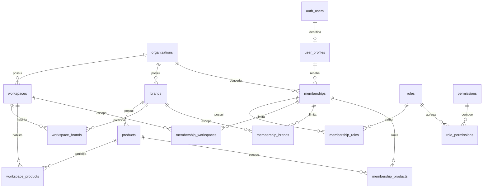

`auth_users` representa a referência externa a `auth.users`, não uma tabela de negócio criada pelo módulo.

| Entidade proposta | Escopo | Finalidade e relações principais |
|---|---|---|
| `organizations` | raiz multiempresa | Empresa proprietária de marcas, produtos, usuários, políticas e limites. Uma organização possui muitos workspaces. |
| `workspaces` | organização | Tenant operacional lógico com `tenant_key`, ambiente `test` ou `production`, timezone, moeda-base e estado. |
| `brands` | organização | Marca atendida, independente do produto MKT Digital e do ambiente. |
| `products` | organização + marca | Produto ou oferta da marca. Uma marca possui zero ou muitos produtos. |
| `workspace_brands` | tenant | Autoriza uma marca a operar naquele workspace; evita duplicar a marca entre teste e produção. |
| `workspace_products` | tenant | Autoriza um produto no workspace e exige que sua marca também esteja habilitada. |
| `user_profiles` | identidade | Extensão 1:0..1 de `auth.users`; não replica senha nem credencial de autenticação. |
| `memberships` | organização | Vínculo do usuário com a organização, com estado e período de validade. |
| `roles` | organização ou catálogo do sistema | Papel nomeado, como administrador, gestor, atendente, compliance ou leitura. |
| `permissions` | catálogo | Permissão atômica e estável; não contém regra contextual de negócio. |
| `membership_roles` | membership | Relação N:N entre memberships e papéis. |
| `role_permissions` | papel | Relação N:N entre papéis e permissões. |
| `membership_workspaces` | membership + tenant | Workspaces que o membership pode acessar. |
| `membership_brands` | membership + marca | Restrição opcional às marcas autorizadas. |
| `membership_products` | membership + produto | Restrição opcional aos produtos autorizados. |
| `service_principals` | tenant | Identidades técnicas de API, webhook e worker, sem sessão humana e com capabilities mínimas. |

Justificativas:

1. Organização, workspace, marca e produto não são sinônimos; separá-los permite multiempresa sem transformar o MVP em SaaS comercial.
2. `test` e `production` são tenants lógicos no mesmo Supabase. Não representam outro projeto contratado.
3. Tabelas de escopo explícitas evitam chaves polimórficas sem FK e permitem testar isolamento no banco.
4. RBAC determina o que o ator pode tentar; Policy Engine ainda determina se a ação concreta é permitida naquele contexto.

## 2. Plugins, Connector Registry e contas externas

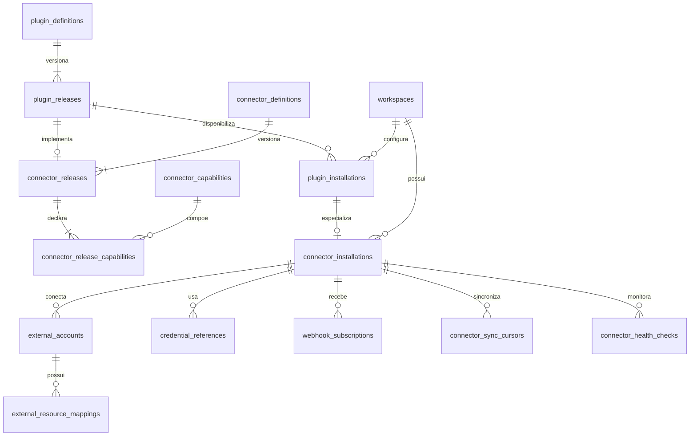

| Entidade proposta | Escopo | Finalidade e relações principais |
|---|---|---|
| `plugin_definitions` | catálogo interno | Identidade estável de plugin first-party e seu tipo: conector, IA, Storage ou serviço interno autorizado. |
| `plugin_releases` | catálogo interno | Release imutável disponível pelo deploy, com versão, compatibilidade, schema de configuração, egress e health check declarados. |
| `plugin_installations` | tenant | Ativação/configuração de um release já implantado; o painel não instala código. |
| `connector_definitions` | catálogo | Família/adaptador de plataforma, separada da conta externa e do tenant. |
| `connector_releases` | catálogo | Versão do adapter e da API externa suportada, vinculada a um release de plugin. |
| `connector_capabilities` | catálogo | Vocabulário granular, por exemplo `campaign.read`, `campaign.create_paused`, `message.reply` e `insights.read`. |
| `connector_release_capabilities` | catálogo | Capabilities realmente suportadas por uma versão, com modo e limitações verificadas. |
| `connector_installations` | tenant | Instância configurada do conector, modo `test`/`production`, flags, allowlists e limites. |
| `external_accounts` | tenant + conector | Página, perfil, conta de anúncios, número, caixa postal ou canal autorizado. |
| `credential_references` | tenant + conector | Ponteiro opaco para segredo no cofre, com tipo, versão, validade e rotação; nunca contém o segredo. |
| `webhook_subscriptions` | tenant + conta externa | Assinatura esperada, versão, status, segredo por referência e cursor anti-replay. |
| `connector_sync_cursors` | tenant + conta externa | Cursor incremental por recurso/capability. |
| `connector_health_checks` | tenant + instalação | Resultados temporais de saúde, scopes, quota e latência, sem vazar credenciais. |
| `external_resource_mappings` | tenant + conta externa | Mapeia uma entidade interna a IDs externos por plataforma e versão do recurso. |

Invariantes:

- um plugin novo só se torna selecionável após revisão, testes e deploy;
- habilitar uma capability no painel não concede uma capability ausente no release;
- configuração e credencial pertencem a um tenant e não podem ser reutilizadas por outro implicitamente;
- plugins não chamam outros plugins nem acessam banco/segredos de forma irrestrita; usam contratos e brokers do núcleo;
- IDs externos nunca substituem IDs internos nem são considerados globalmente únicos sem plataforma e conta.

## 3. AI Orchestrator, provedores, prompts e execuções

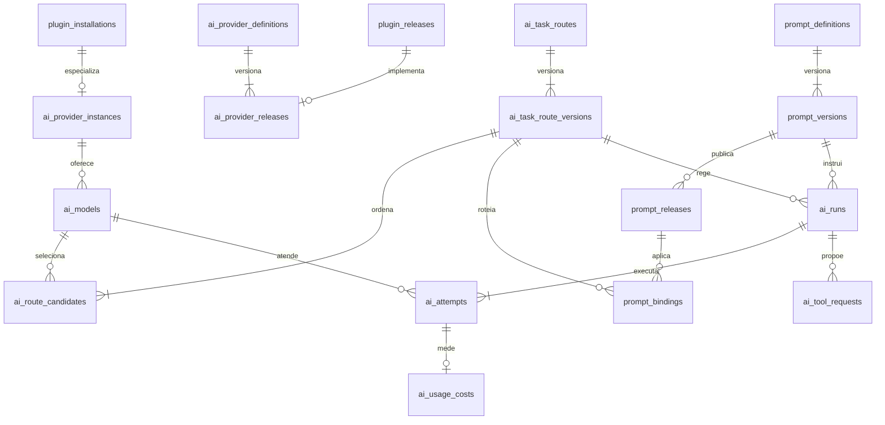

| Entidade proposta | Escopo | Finalidade e relações principais |
|---|---|---|
| `ai_provider_definitions` | catálogo | Identidade do provider suportado, sem acoplar o core a OpenAI, Claude, Gemini ou outro. |
| `ai_provider_releases` | catálogo | Adapter/versionamento do protocolo do provider, implementado por plugin implantado. |
| `ai_provider_instances` | tenant | Configuração autorizada, referência de segredo, limites, região/privacidade e estado de saúde. |
| `ai_models` | tenant + provider | Modelo disponível e capabilities observadas; preço e limites são versionados/temporalizados. |
| `ai_task_routes` | tenant | Definição estável de uma tarefa, como resposta, legenda, compliance ou análise. |
| `ai_task_route_versions` | tenant | Política imutável de timeout, teto de custo, fallback, revisão cruzada e tratamento de PII. |
| `ai_route_candidates` | tenant | Ordem/condições dos providers e modelos candidatos da versão de rota. |
| `prompt_definitions` | tenant | Identidade estável do patrimônio de prompt por objetivo/domínio. |
| `prompt_versions` | tenant | Conteúdo imutável, idioma, autor, hash, variáveis aceitas e status de validação. |
| `prompt_releases` | tenant | Versão aprovada para uso; rollback apenas troca o release ativo. |
| `prompt_bindings` | tenant | Escopo da release por organização, workspace, marca, produto, canal e tarefa. |
| `ai_runs` | tenant | Execução lógica com rota/prompt exatos, finalidade, ator, hashes de entrada/saída e decisão. |
| `ai_attempts` | tenant | Cada tentativa em provider/modelo, incluindo fallback, tempo, status e erro redigido. |
| `ai_usage_costs` | tenant | Tokens/unidades e custo exato por tentativa, com moeda e fonte do preço. |
| `ai_tool_requests` | tenant | Proposta de ferramenta de alto nível. Nunca é prova de que a ação externa ocorreu. |

Justificativas:

1. `ai_run` é a tarefa lógica; `ai_attempt` permite falha, fallback, comparação e revisão sem perder rastreabilidade.
2. Provider, modelo, rota e prompt são dimensões diferentes e não devem ser combinadas em uma tabela ampla.
3. Uma tool request precisa gerar comando interno sujeito a RBAC, Policy Engine e Approval Engine; a IA não recebe credenciais de plataforma.
4. Entradas públicas são dados não confiáveis. O modelo guarda referências/hashes e classificação de risco, não transforma conteúdo recebido em instrução do sistema.

## 4. Mídia, celebridades, contratos e territórios

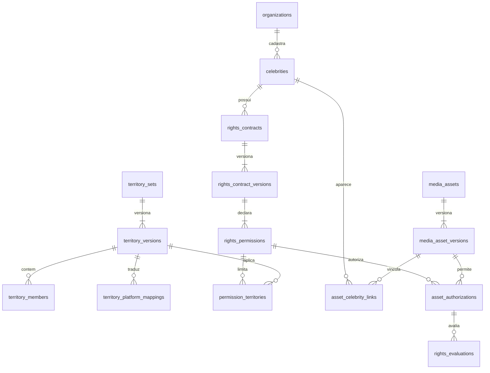

| Entidade proposta | Escopo | Finalidade e relações principais |
|---|---|---|
| `celebrities` | organização | Pessoa pública cadastrada e seu estado operacional; não presume nenhum direito. |
| `rights_contracts` | organização | Identidade estável do instrumento de direitos e referência ao documento protegido. |
| `rights_contract_versions` | organização | Versão imutável com hash do documento/fonte, vigência informada, estado e aprovador. |
| `rights_permissions` | organização | Regra explicitamente extraída/confirmada para modalidade, plataforma, formato, edição e aprovação. Ausência significa bloqueio. |
| `territory_sets` | organização | Identidade estável de um território operacional. |
| `territory_versions` | organização | Tradução operacional versionada da descrição contratual, com estado e aprovação. |
| `territory_members` | organização | Inclusões/exclusões validadas, como localidade, raio, polígono ou outro tipo suportado. |
| `territory_platform_mappings` | organização | IDs/representação do território em uma plataforma e versão de API específicas. |
| `permission_territories` | organização | N:N entre permissão contratual e versão territorial aplicável. |
| `media_assets` | tenant/organização | Ativo lógico e proprietário; os bytes ficam no Storage privado. |
| `media_asset_versions` | tenant | Arquivo imutável por bucket/path, hash, MIME, dimensões, origem e estado de malware/moderação. |
| `asset_celebrity_links` | tenant | Declara quem aparece/é ouvido no arquivo e a natureza do vínculo. |
| `asset_authorizations` | tenant | Vincula versão exata do ativo a permissão contratual explícita e seu escopo. |
| `rights_evaluations` | tenant | Evidência da validação antes/depois da ação: versões, destino, período, território, decisão e motivos. |

Regras fail-closed:

- cadastro de celebridade, contrato ou arquivo não concede uso;
- clonagem de voz, mudança de rosto ou geração de nova fala exige permissão explícita cadastrada;
- vencimento/revogação invalida novas aprovações e bloqueia ações futuras relacionadas;
- tráfego pago com Cauã Reymond permanece bloqueado até a lista operacional da região e as datas serem fornecidas e aprovadas;
- orgânico com Cauã não recebe restrição territorial inventada, mas continua condicionado a ativo, vigência, plataforma, formato, modalidade e edição autorizados;
- quando a plataforma não representar o território com segurança, a ativação é bloqueada.

## 5. Templates, conteúdo e publicação

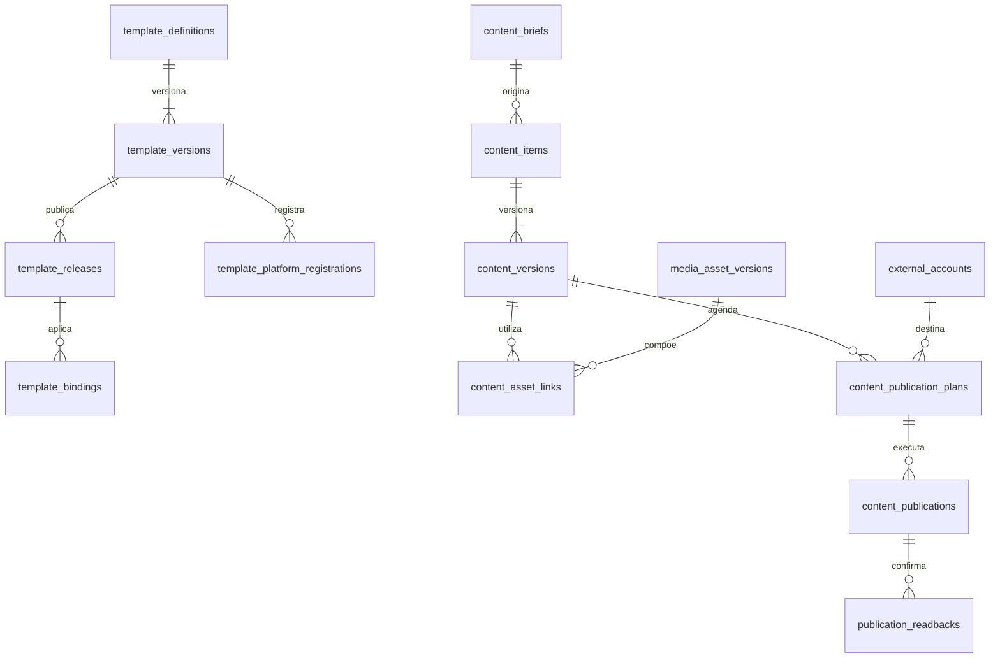

| Entidade proposta | Escopo | Finalidade e relações principais |
|---|---|---|
| `template_definitions` | tenant/organização | Identidade estável de template de canal/formato, separada de prompt de IA. |
| `template_versions` | tenant | Conteúdo e variáveis imutáveis para Instagram, Stories, Reels, WhatsApp, e-mail, anúncios ou landing pages. |
| `template_releases` | tenant | Versão interna aprovada e ativa. |
| `template_bindings` | tenant | Escopo por marca, produto, idioma, canal, formato e objetivo. |
| `template_platform_registrations` | tenant + conta | Status/ID/rejeição do template registrado externamente, por exemplo no WhatsApp; não substitui aprovação interna. |
| `content_briefs` | tenant + marca/produto | Objetivo, público, canal, restrições e origem do pedido. |
| `content_items` | tenant + marca/produto | Peça lógica, independente da plataforma e de uma versão específica. |
| `content_versions` | tenant | Texto/roteiro/metadados imutáveis, hash e referências exatas a prompt/template/revisões. |
| `content_asset_links` | tenant | N:N entre versão de conteúdo e versões de mídia, com função como principal, thumbnail ou anexo. |
| `content_publication_plans` | tenant + conta | Destino, formato, horário, payload/hash aprovado e estado; começa em rascunho. |
| `content_publications` | tenant + conta | Tentativa lógica de publicação e ID externo observado. |
| `publication_readbacks` | tenant | Estado lido de volta, divergências e reconciliação pós-publicação. |

Uma aprovação é inválida se qualquer versão de conteúdo, mídia, template, direitos, destino ou payload mudar. Material de teste não pode ter plano destinado a conta/bucket de produção enquanto as flags de escrita estiverem bloqueadas.

## 6. Campanhas, anúncios, criativos e orçamento

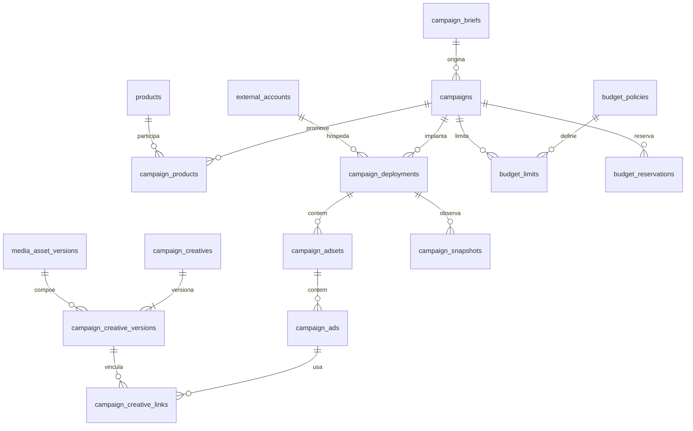

| Entidade proposta | Escopo | Finalidade e relações principais |
|---|---|---|
| `campaign_briefs` | tenant + marca/produto | Objetivo, restrições, público proposto, orçamento e evidências de origem. |
| `campaigns` | tenant + marca | Campanha lógica interna; pode ter implantação em mais de uma plataforma sem perder identidade. |
| `campaign_products` | tenant | Relação N:N entre campanha e produtos promovidos. |
| `campaign_deployments` | tenant + conta externa | Representação em uma conta/plataforma, sempre criada pausada/rascunho no MVP. |
| `campaign_adsets` | tenant + deployment | Conjunto/grupo interno e seu mapeamento externo. |
| `campaign_ads` | tenant + adset | Anúncio interno e seu estado desejado/observado; nasce pausado. |
| `campaign_creatives` | tenant | Criativo lógico reutilizável sob regras de direito. |
| `campaign_creative_versions` | tenant | Versão imutável de texto, mídia, formato e hash. |
| `campaign_creative_links` | tenant | Relação N:N entre anúncio e versão exata de criativo. |
| `budget_policies` | organização/tenant | Regras versionadas de teto, variação máxima, cooldown e aprovação. |
| `budget_limits` | tenant | Teto por conta, campanha e período, com moeda explícita. |
| `budget_reservations` | tenant | Reserva concorrente que impede duas ações de ultrapassarem o mesmo limite. |
| `campaign_snapshots` | tenant + deployment | Readback normalizado e hash do estado observado na plataforma. |

Invariantes:

- campanha, adset e anúncio novos nascem pausados ou em rascunho;
- criação bem-sucedida sem readback é `succeeded_unverified`, não sucesso final;
- orçamento desejado, valor anterior, valor proposto e valor observado permanecem separados;
- alteração de orçamento usa reserva/controle transacional curto; nenhuma chamada HTTP ocorre enquanto lock de banco estiver aberto;
- território, idade, posicionamento, direitos e orçamento são reavaliados antes da criação e após o readback;
- ativação não é efeito colateral da criação e exige autorização específica.

## 7. Caixa omnichannel, consentimento e CRM

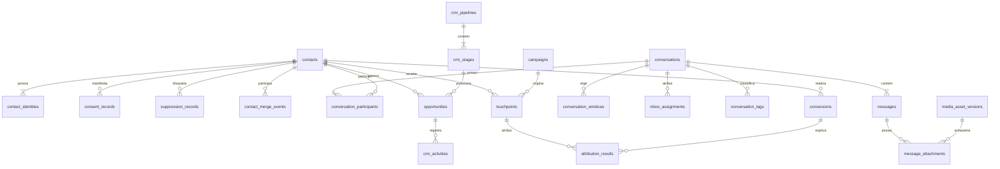

| Entidade proposta | Escopo | Finalidade e relações principais |
|---|---|---|
| `contacts` | tenant | Pessoa/lead canônico, com dados mínimos e estado de privacidade. Não é automaticamente usuário do app. |
| `contact_identities` | tenant + canal | Identidade externa por conector/conta, com unicidade no escopo correto e nível de verificação. |
| `consent_records` | tenant + contato | Evidência append-only de concessão/retirada por canal, finalidade, origem e data. |
| `suppression_records` | tenant + contato | Bloqueio por descadastro, canal, finalidade, política ou incidente; prevalece sobre automação. |
| `contact_merge_events` | tenant | Histórico auditável de fusão/desfusão, evitando perda silenciosa de identidade. |
| `conversations` | tenant + canal | Thread normalizada, conta/canal, contato, estado, prioridade, SLA e modo de atendimento. |
| `conversation_participants` | tenant | Participantes internos/externos com papel e identidade original. |
| `messages` | tenant + conversa | Mensagem normalizada e metadados originais, direção, status, finalidade e deduplicação. |
| `message_attachments` | tenant | Vínculo da mensagem à versão de mídia sanitizada no Storage. |
| `conversation_windows` | tenant + conversa | Janela temporal calculada conforme canal/política e sua evidência. |
| `inbox_assignments` | tenant + conversa | Handoff humano com responsável, lease, timeout, início e encerramento. |
| `conversation_tags` | tenant | Relação entre conversa e tag versionada/configurada. |
| `crm_pipelines` | tenant | Funil configurável da marca/produto. |
| `crm_stages` | tenant + pipeline | Estágio ordenado; mudança de estágio é registrada como atividade. |
| `opportunities` | tenant | Oportunidade ligada a contato, produto, pipeline, estágio e responsável. |
| `crm_activities` | tenant | Nota, tarefa, mudança, contato ou evento do CRM, com ator e data. |
| `touchpoints` | tenant | Interação de aquisição/relacionamento com origem, campanha, anúncio, criativo e UTMs quando disponíveis. |
| `conversions` | tenant | Evento de negócio confirmado por fonte autorizada, sem presumir atribuição. |
| `attribution_results` | tenant | Resultado por método: informado pela plataforma, determinístico, inferido ou desconhecido. |

Regras do WhatsApp no MVP:

- atendimento é inbound-first;
- resposta livre só ocorre dentro da janela válida calculada;
- fora da janela, somente template previamente aprovado e finalidade permitida;
- marketing exige opt-in específico; utilidade também precisa respeitar finalidade, política e supressão;
- prospecção fria, lista comprada e disparo em massa não são modelados como capability do MVP;
- handoff humano mantém lease transacional para impedir dupla resposta;
- toda tentativa e resposta é ligada à ação externa e à auditoria.

## 8. Policy Engine, aprovações, flags, ações externas e auditoria

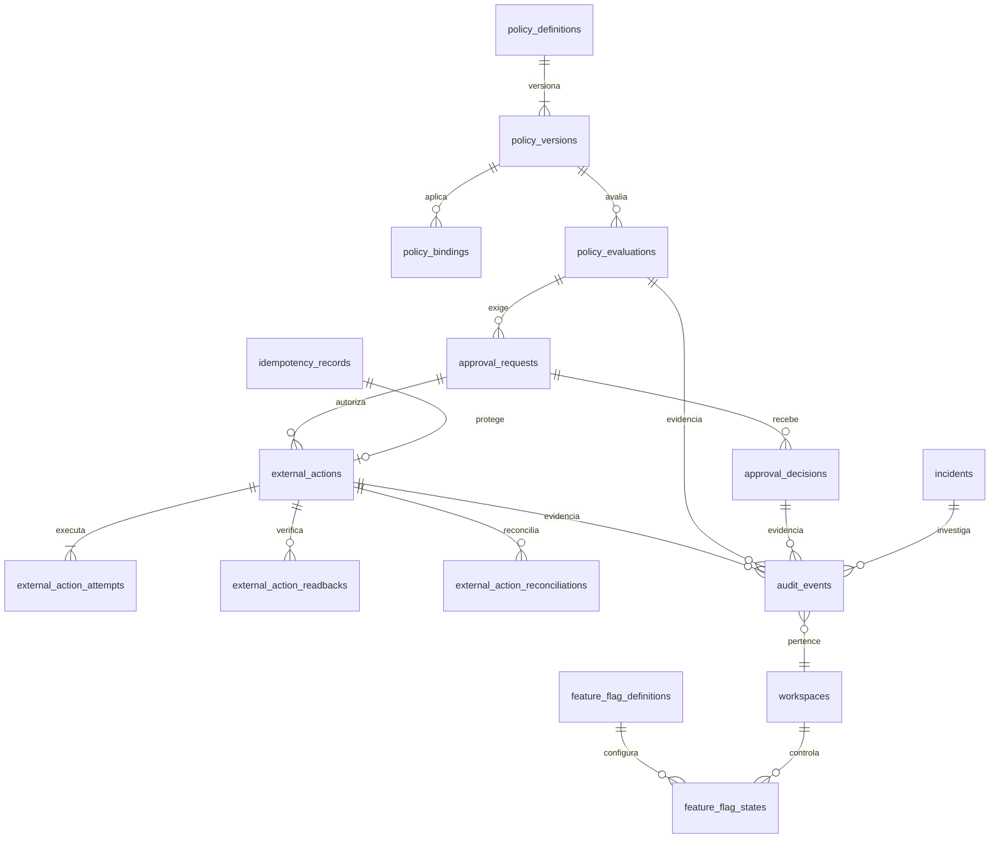

| Entidade proposta | Escopo | Finalidade e relações principais |
|---|---|---|
| `policy_definitions` | organização/tenant | Identidade estável da regra de negócio/compliance. |
| `policy_versions` | organização/tenant | Regra imutável, prioridade, efeito, vigência, autor e hash. |
| `policy_bindings` | tenant | Escopo por ação, capability, marca, produto, canal e risco. |
| `policy_evaluations` | tenant | Snapshot das entradas/versionamentos, resultado `allow`/`deny`/`approval_required` e motivos. |
| `approval_requests` | tenant | Pedido vinculado ao hash exato do payload, versions, destino, custo e expiração. |
| `approval_decisions` | tenant | Decisão append-only por aprovador autorizado; nova decisão não reescreve a anterior. |
| `feature_flag_definitions` | catálogo | Flag conhecida, risco e comportamento seguro padrão. |
| `feature_flag_states` | tenant | Valor por workspace/marca/conector/capability, vigência e ator. |
| `external_actions` | tenant | Comando canônico para qualquer write externo, com estado, idempotência, correlation e alvo. |
| `external_action_attempts` | tenant | Tentativas individuais, request/response redigidos, erro, retry e identificador externo. |
| `external_action_readbacks` | tenant | Estado lido de volta e comparação com o payload aprovado. |
| `external_action_reconciliations` | tenant | Resolução de resultado incerto, drift ou compensação. |
| `idempotency_records` | tenant | Chave, escopo, hash da requisição, recurso/resultado e validade. |
| `audit_events` | tenant/organização | Trilha append-only de ator humano/IA/serviço, before/after redigido, políticas, aprovações e correlation ID. |
| `incidents` | tenant/organização | Caso operacional/de segurança, severidade, estado, responsável e evidências relacionadas. |

Fluxo relacional obrigatório de escrita externa:

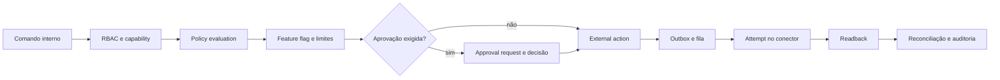

O hash de aprovação deve incluir tudo que possa alterar o risco. Qualquer mudança relevante invalida a aprovação. Kill switch global/tenant/conector/capability e supressão aplicável têm precedência sobre uma aprovação antiga.

## 9. Eventos, outbox, jobs, scheduler e DLQ

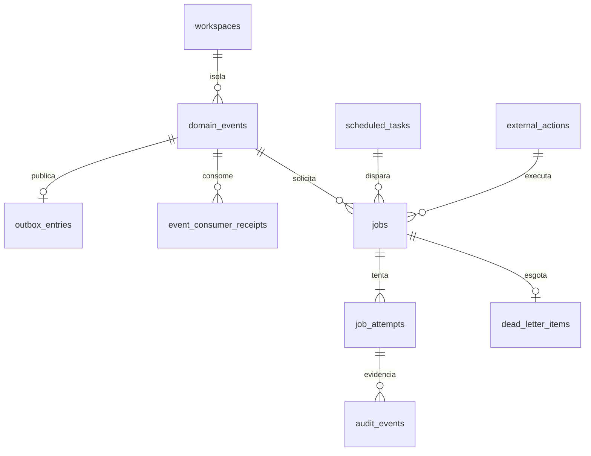

| Entidade proposta | Escopo | Finalidade e relações principais |
|---|---|---|
| `domain_events` | tenant | Evento imutável, versionado, com aggregate, correlation, causation e referência mínima ao payload. Não é event sourcing. |
| `outbox_entries` | tenant | Estado de entrega do evento/referência à fila, gravado na mesma transação do estado e auditoria. |
| `event_consumer_receipts` | tenant + consumidor | Deduplicação por `event_id`, consumidor e versão; guarda resultado e tentativa. |
| `scheduled_tasks` | tenant | Agenda declarativa, timezone, próxima execução, política de concorrência e flag. |
| `jobs` | tenant | Unidade canônica de trabalho com tipo, prioridade, lease, status, tentativas e referência de payload. |
| `job_attempts` | tenant | Execução de um job por worker, com heartbeat, timeout, resultado e erro redigido. |
| `dead_letter_items` | tenant | Job/evento esgotado, motivo, evidência, decisão de reprocessar ou encerrar. |

Invariantes:

- entrega é `at-least-once`; todos os consumidores são idempotentes;
- o payload no PGMQ contém somente referência mínima; o registro canônico está em `mod_mkt`;
- claim de jobs é atômico, não bloqueante e com lease/visibility timeout;
- transações são curtas e nunca incluem HTTP externo;
- limite de profundidade, causation ID e detecção de ciclos impedem tempestades de eventos;
- reprocessar DLQ exige permissão e auditoria;
- evento não contorna Policy Engine nem executa write externo diretamente.

## 10. Turbo Analytics e atribuição

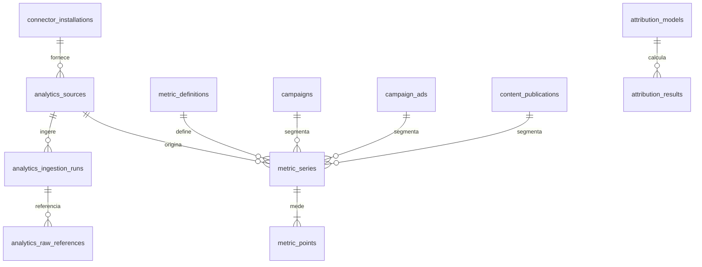

| Entidade proposta | Escopo | Finalidade e relações principais |
|---|---|---|
| `analytics_sources` | tenant | Fonte autorizada, conta/conector, timezone, moeda e estado de sincronização. |
| `analytics_ingestion_runs` | tenant + fonte | Janela/cursor, versão do conector, status, contagens, freshness e erro. |
| `analytics_raw_references` | tenant + ingestão | Referência opcional a payload bruto minimizado no Storage, hash e retenção. |
| `metric_definitions` | catálogo/organização | Semântica canônica, unidade, agregação válida, dimensões e incompatibilidades conhecidas. |
| `metric_series` | tenant + fonte | Série única por métrica, origem, granularidade, moeda, timezone e hash de dimensões. |
| `metric_points` | tenant + série | Valor numérico exato ou contagem para um período, com qualidade/freshness. |
| `attribution_models` | tenant | Definição/versionamento do método de atribuição permitido. |
| `attribution_results` | tenant | Resultado ligado a conversão/touchpoints, método, confiança e data de cálculo. |

Justificativas:

1. `metric_definition` impede somar métricas homônimas com semântica diferente entre plataformas.
2. Série separada de ponto reduz repetição de dimensões em volume alto.
3. Ingestão incremental e agregados horários/diários protegem quota externa e Disk IO Budget do Supabase compartilhado.
4. Payload bruto não é o dashboard nem a fonte semântica; serve apenas para reconciliação dentro da retenção aprovada.
5. Analytics operacional no MVP não é data warehouse e não cria acoplamento direto às tabelas grandes do aplicativo.

## 11. Relações críticas entre domínios

As relações abaixo atravessam diagramas e precisam permanecer explícitas:

| Origem | Cardinalidade | Destino | Motivo |
|---|---|---|---|
| `workspaces` | 1:N | toda entidade operacional | Isolamento obrigatório por tenant. |
| `brands` / `products` | 1:N ou N:N | conteúdo, campanhas, templates, policies e analytics | Contextualizar a operação sem acoplar o produto MKT Digital a uma marca. |
| `external_accounts` | 1:N | publicações, deployments, mensagens e fontes analytics | Determinar o destino exato e o escopo da credencial. |
| `media_asset_versions` | N:N | conteúdo, criativos, anexos e autorizações | Reutilização somente pela versão/hash exatos. |
| `rights_evaluations` | N:1 | versão de ativo + permissão + ação | Provar que direitos foram avaliados para aquele uso concreto. |
| `policy_evaluations` | N:1 | ação/versões avaliadas | Preservar a decisão mesmo após nova versão da política. |
| `approval_requests` | 0..N:1 | ação externa | Uma ação pode ser reapresentada; só a aprovação válida para o hash atual serve. |
| `external_actions` | 1:N | tentativas/readbacks/auditoria/jobs | Separar intenção, execução, observação e reconciliação. |
| `domain_events` | 1:0..N | jobs/receipts | Desacoplar módulos com entrega repetível e rastreável. |
| `contacts` | 1:N | identidades/conversas/oportunidades/touchpoints/conversões | Visão unificada sem apagar a origem de canal. |
| `ai_runs` | 0..N:1 | conteúdo, mensagem, análise ou policy auxiliar | IA participa da decisão, mas não é ator externo autônomo. |

Entidades com múltiplos tipos de origem não devem usar uma coluna polimórfica sem integridade. A migration deve preferir tabelas de vínculo explícitas ou referências mutuamente exclusivas protegidas por constraints.

## 12. Invariantes verificáveis para as futuras migrations

### Isolamento e autorização

1. Uma consulta sem tenant válido não retorna nem altera dados operacionais.
2. Um ID válido de outro tenant não pode ser ligado por FK, API ou worker.
3. O tenant é derivado da sessão/credencial técnica autorizada; nunca é confiado ao frontend.
4. Workspace `test` não pode usar conta, credential reference, bucket/path ou ação de `production`.
5. Roles técnicas não possuem privilégios nos schemas do aplicativo além de interfaces explicitamente aprovadas.

### Governança e ações externas

1. Nenhuma external action executável existe sem policy evaluation válida.
2. Aprovação expirada ou com hash divergente não autoriza execução.
3. Repetir a mesma idempotency key com payload diferente falha fechado.
4. Resultado incerto não é repetido antes de readback/reconciliação.
5. Campanhas/anúncios novos têm estado desejado pausado; ativação é capability separada e inicialmente desligada.
6. Toda tentativa externa produz auditoria, inclusive bloqueio, timeout e falha de validação.

### Direitos, consentimento e atendimento

1. Ausência de permissão contratual explícita bloqueia uso de celebridade.
2. Direitos são avaliados contra versões exatas de contrato, território, ativo, formato, plataforma, modalidade e data.
3. Supressão/descadastro prevalece sobre automação e campanha.
4. Mensagem fora da janela só pode seguir pelo template/capability e finalidade permitidos.
5. Lease de handoff impede resposta automática e humana concorrentes.

### Eventos, jobs e analytics

1. Reentrega do mesmo evento não duplica efeito.
2. Job sem heartbeat expira de forma recuperável; tentativa antiga não confirma resultado novo.
3. DLQ mantém evidência e não reprocessa automaticamente após esgotamento.
4. Pontos analytics só são agregados quando definição, unidade, moeda, timezone e granularidade são compatíveis.
5. Retenção e índices são definidos antes de liberar ingestão em volume.

## 13. Estratégia de exclusão e retenção

As durações ainda dependem das decisões de LGPD e negócio, mas o ERD separa categorias para que a política possa ser aplicada:

| Categoria | Tratamento proposto |
|---|---|
| Catálogos e configurações | exclusão lógica ou desativação quando houver referências históricas |
| Versões aprovadas | imutáveis; nova versão substitui a ativa |
| Auditoria, aprovações e ações externas | append-only; retenção legal/operacional e acesso restrito |
| Contatos, mensagens e anexos | minimização, retenção por finalidade e anonimização/exclusão conforme decisão jurídica |
| Webhooks e payloads brutos | retenção curta, conteúdo minimizado ou objeto privado referenciado |
| Métricas detalhadas | retenção por granularidade; consolidação em agregados antes do descarte quando permitido |
| Segredos | rotação/revogação no cofre; somente a referência e a evidência operacional permanecem |

Não serão definidos prazos jurídicos, bases legais ou campos contratuais sem validação do responsável.

## 14. Ordem recomendada de materialização

O ERD não autoriza implementação. Quando cada marco for aprovado, a ordem de dependência recomendada é:

1. organizações, workspaces, marcas, produtos, usuários, memberships e RBAC;
2. feature flags, auditoria e identidades técnicas;
3. registries de plugins/conectores, instalações e credential references;
4. Policy Engine, approvals, idempotência e external actions;
5. eventos, outbox, jobs, tentativas e DLQ;
6. mídia, celebridades, contratos, territórios e rights evaluations;
7. contatos, consentimentos, inbox e CRM;
8. AI Orchestrator, providers, rotas, prompts, templates e runs;
9. conteúdo/publicações e campanhas/orçamento;
10. fontes, ingestões, métricas e atribuição do Turbo Analytics.

Cada bloco deve entrar por migration pequena, aditiva e versionada, com backup prévio, verificação de grants/RLS/FKs/índices, teste cross-tenant e migration compensatória. Nenhuma migration é criada ou aplicada no Marco M0.

## 15. Decisões deliberadamente não inventadas

O ERD reserva estruturas, mas não fixa:

- dados, datas, territórios ou permissões do contrato de Cauã Reymond;
- bases legais, prazos de retenção ou procedimento final de direitos do titular;
- matriz nominal de aprovadores, possibilidade de autoaprovação e limites de orçamento;
- scopes/API permissions que ainda dependam de aprovação da plataforma;
- modelos, preços, teto diário e política de dados do primeiro provider de IA;
- formato físico definitivo de cada chave, índice ou partição antes dos testes do marco correspondente.

Enquanto uma informação obrigatória não estiver definida, o comportamento associado permanece bloqueado.
